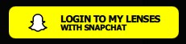
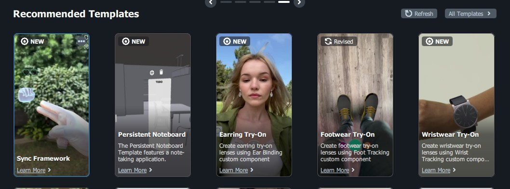
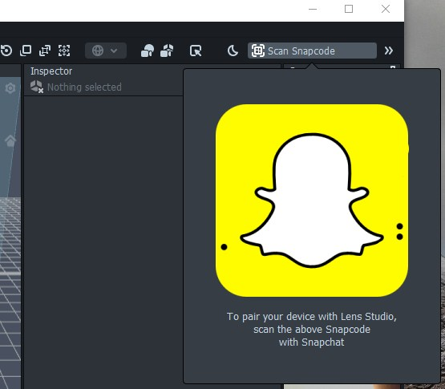
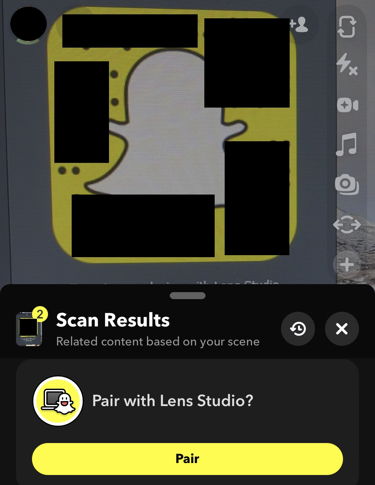

# Snapchat Camera Roll Stealth Filter

Snapchat Lens Studio allows developers to "Build, Preview, and Distribute AR" experiences to Snapchat users.

I have identified a bug that allows users to take advantage of the 'Preview' function, allowing them to send items from their camera roll without displaying any type of filter to the recipient.

**There is a risk of getting your account banned by testing this bug. Please do not use this for nefarious reasons.**
## Installation

Install Snapchat Lens Studio (https://ar.snap.com/download)

Open up and Sign into Lens Studio using the account to gain the camera upload filter:

Once logged in, select and open a sample template in Lens Studio:

In the top right, select **Scan Snapcode**

then scan this using your phone:

## 🔗 Links

## Overview - Snapchat API

